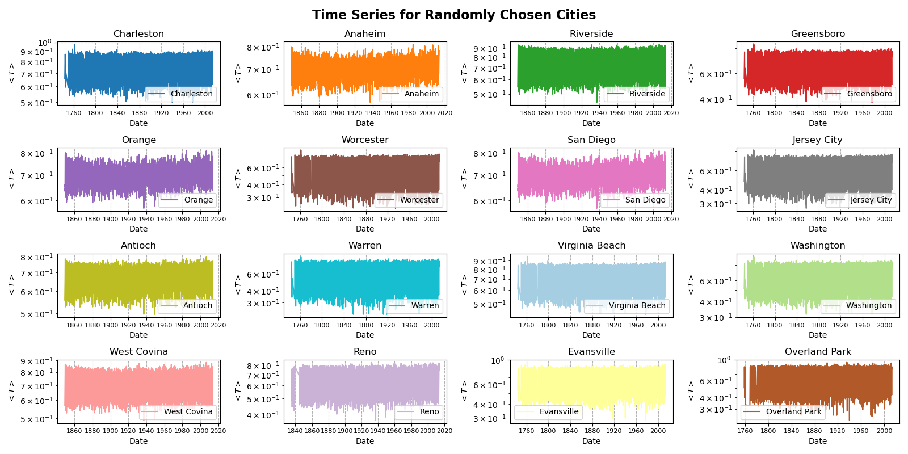
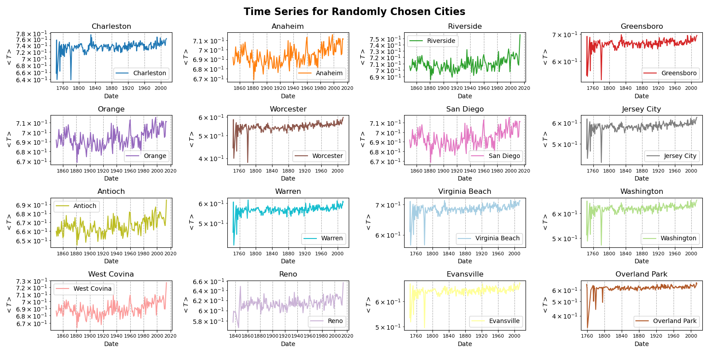
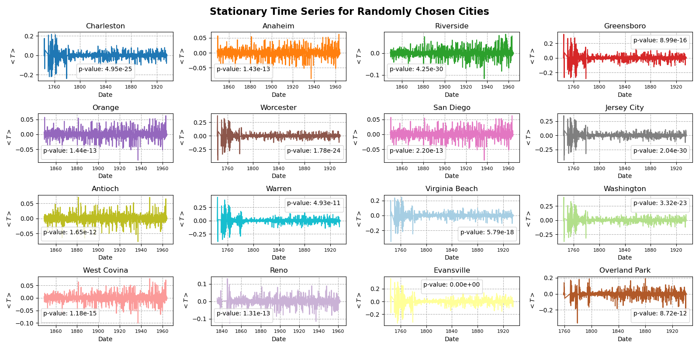
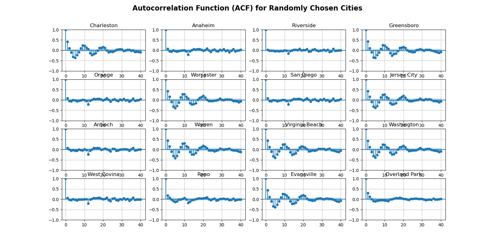
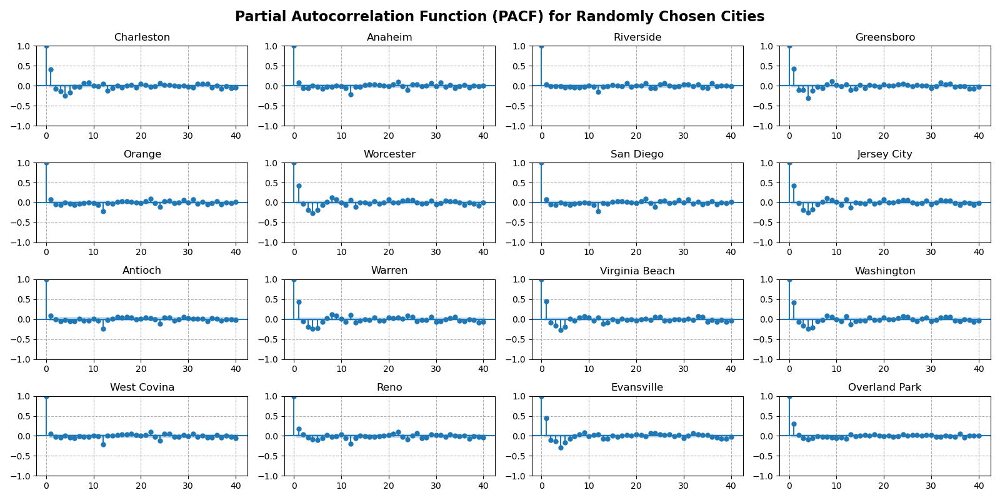

# Temperature-forecasting-for-different-cities-in-the-world

## Task 3: Temperature Forcasting - Bellou 

The aim of this section is to build an ARIMA model that forcasts temperature $<T>$ levels for US cities over a period of time $\Delta t$. The data used for this is labeled `GlobalLandTemperaturesByCity.csv`. It is composed of $7$ (features) columns: AverageTemperature, AverageTemperatureUncertainty, City, Country, Latitude, and Longitude, and $8599212$ (observations) rows. The data is dated from 1743-11-01 untill 2013-09-01. 

To accomplish the aim of this section three subtasks must be done: 

1. Cleaning the temperature data
2. Making the time series statioanry 
3. Implementing the ARIMA model and using it to forcast 


### 1. Cleaning the Data

First the `NaN` values were dropped and the duplicates were removed. Then, the index of the `DataFrame` object was set to the `Date` column and its type was converted to pandas `datetime` type. Afterwards, only the data corresponding to US cities was kept and the rest were dropped. Similarly, only the relevant features were kept. Finally, the `AverageTemperature` were scaled by mapping their values to the interval $[0, 1]$, and the columns were grouped by `City`.

This workflow was implemnted in function labeled `clean_data(df, period)` which takes the data as an input and outputs the corresponding time series. 

```python
def clean_data(df, period):
    if not period in ["YE", "ME"]:
        return "Option not supported, please use either YE or ME"
    # Then we clean the data by first removing the NaN values
    df = df.dropna()
    # The droping duplicates 
    df = df.drop_duplicates(subset=None, keep='first')
    # Setting the data as index 
    # Now we set the data as an index 
    df.set_index("dt", inplace=True)
    # After that we set the type for the index to be datetime 
    df.index = pd.to_datetime(df.index)
    mask = df["Country"] == "United States" # Creating a mask that seclects the US from the data 
    df = df[mask] # applying the mask to the dataframe 
    df = df.drop(["AverageTemperatureUncertainty", "Country", "Longitude", "Latitude"], axis=1)
    # Saving the average temperature temporarily in variable 
    temp_vals = df["AverageTemperature"].values.reshape(-1, 1)
    scaler = MinMaxScaler() # Calling the scaler to map the data to the interval [0, 1] 
    scaled_temp = scaler.fit_transform(temp_vals) # Scale the data 
    df["AverageTemperature"] = scaled_temp # Assign the scaled values to their dataframe 
    # df = df.groupby(["City"]).resample("YE").mean() # Grouping the values by city and averaging the 
                                                    # Temperature per year
    df = df.groupby(["City"]).resample(period).mean() # Grouping the values by city and averaging the 
    
    df = df.dropna()    # Droping the NaN values
    return df
```
The below figure show the time series of the following $16$ cities: Charleston, Anaheim, Riverside, Greensboro, Orange, Worcester, San Diego, Jersey City, Antioch, Warren, Virginia Beach, Washington, West Covina, Reno, Evansville, Overland Park. 



The time series in the previous figure seems abit stacked and it doesn't show the changes over time, to make the visulization a bit neat the data was resmbled per year and the corresponding average temperature values were averaged. The resulting figure is shown below.
<!-- To make the visulizations look a bit nicer the data was resembled per year and the values of the average temperature $<T>$ was averaged  -->




### 2. Making the Time Series Stationary 

In this step the time series for all cities will be divided into two sets: train, and testing. The training set will contain $70%$ of the data, while the testing set will have the remaining $30%$. The first will be used to train the ARIMA model, and the predictions will be tested against the test set. The splitting was done with the help `sci-kit learn` method `train_test_split`.

- The training set has  $2183$ observations 
- The test set has $936$ observations. 

Next, the seasonal decomposition was performed on the training set, then the seasonal and trend components were removed from it, resulting in a stationary time series. Afterwards, the stationarity of the time series of the $248$ cities was tested using the Augmented Dickey-Fuller Test statistic. The resulting `p-value` were below the threshold of $0.05$ suggesting that is safe to reject the null hypothesis of the non-stationarity of the time series. Hence, we accept the alternative hypothesis that the time series are stationary. 

```python
# Checking for stationarity of the data 
def check_stationarity(series):
    result = adfuller(series)
    return result[1] > 0.05, result[1]  # If True, series is non-stationary
count = 0 # Counter for non-stationary time series   
for key, value in train_data_stationary.items(): 
    data = train_data_stationary[key]
    X = data["AverageTemperature"]
    check, p_val = check_stationarity(X)
    if check:
        count += 1
        print(key)
        print(p_val)
print(f"The are {count} Time series that are non-stationary")
```


```console
The are 0 Time series that are non-stationary
```



### 3. The ARIMA Model

After the time series were made stationary, and their stationarity was checked, we move forward to the last step of this section and implement the ARIMA model, then use it to forcast. 






The optimal paramters `p, q, d` of the model were selected, and the model was trained on the training set. Then it was used to forcast the temperature for the test set. The accuracy for each predictions was measured using the mean square error metric

$$
MSE = \frac{1}{N} \sum\limits_{i=1}^{N} \left \lVert y_i - \hat{y}_i \right \rVert ^2
$$

- $y_i$ Corresponds to the true value in the test data 
- $\hat{y}_i$ corresponds to the model's predictions 


