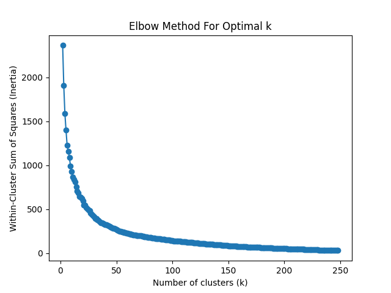
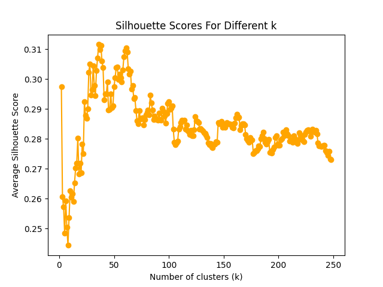
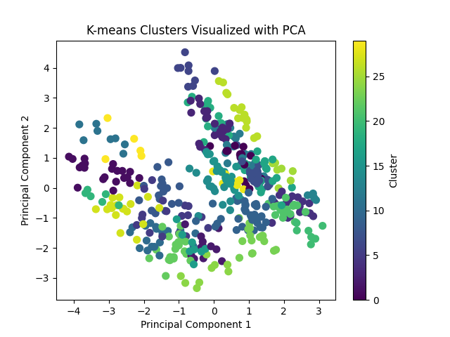
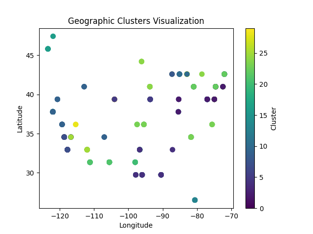

# On Climate Forecasting

We did the data cleaning all together.

## Task 1: Cluster Analysis

### Data Cleaning

The original analysis is based on three raw datasets:

- `pollution_us_2000_2016`: Contains air pollutant measurements (NO₂, SO₂, CO) across various U.S. cities from 2000 to 2016.
- `greenhouse_gas_inventory_data_data`: Contains CO₂ emissions data categorized by source type and region.
- `GlobalLandTemperaturesByCity`: Provides average monthly land temperature records for cities around the world.

To prepare these datasets for analysis, the following cleaning and integration steps were applied:

1. Date Normalization:

    - Dates in all datasets were originally in varying formats (day/month/year).
    - To enable uniform temporal aggregation, all date columns were converted to a standard Year format by extracting only the year component.

2. City-Year Grouping:

    - After converting dates to years, the data was grouped by unique pairs of City and Year.
    - For each city-year pair, numerical features were averaged to produce annual summary statistics.

3. Merged Dataset Construction:

    - The datasets were then merged on the basis of City and Year, aligning temperature, pollutant, and CO₂ data.
    - The result is a unified dataset with the following features:
       
        | Feature | Description |
        | ------- | ----------- |
        | `City`  | Name of the city |
        | `Year`  | Year of observation (integer) |
        | `AverageTemperature` | Mean annual land temperature |
        | `NO2 Mean`	| Mean annual NO₂ concentration |
        | `SO2 Mean`	| Mean annual SO₂ concentration |
        | `CO Mean`	| Mean annual CO concentration |
        | `Latitude` | Geographic latitude of the city |
        | `Longitude` |	Geographic longitude of the city |
        | `Avg_CO2_natural_pross` |	Average CO₂ emissions from natural processes |

**The code of the data cleaning of Task 1 is [here](Cleaning_data_Task1.ipynb)**

### How We Applied Cluster Analysis on The New Data

**The code of the Cluster Analysis is [here](Project3_nicola.ipynb)**

We have studied 248 cities. The dataset includes measurements of several environmental indicators such as Average Temperature, NO₂ Mean, SO₂ Mean, CO Mean, and Avg_CO₂_natural_pross. The **goal** of this analysis is to explore natural groupings within the data using the K-means clustering algorithm. Additionally, geographic coordinates (Latitude and Longitude) are incorporated to provide insights into the spatial distribution of the clusters.

The data are preprocessed in **two modes**:

- `City-Year` Level: Each record represents a unique city and year. 
- `City` Level: Measurements are averaged over all years, resulting in one record per city.

#### Methodology

- Elbow Method: The within-cluster sum-of-squares is computed for a range of potential cluster counts. A plot is generated to help visually identify the “elbow,”. _Still, this is not the most easier way to determine the number of cluster_.
- Silhouette Score: For each number of clusters, the average silhouette score is calculated to assess the compactness and separation of the clusters. Higher silhouette scores indicate better-defined clusters. _It was important to support Elbow method with Silhouette Score for best `k` value_.

#### Clustering Execution

- K-means Clustering: Based on the evaluation metrics, a specific number of clusters is selected. The K-means algorithm is then applied to partition the dataset into clusters.
- Visualization:
  - PCA Visualization: Principal Component Analysis (PCA) is applied to reduce the dimensionality of the data, and a 2D scatter plot is generated where points are colored by their cluster label.
  - Geographic Visualization: When geographic coordinates are included, a separate scatter plot of the actual Latitude and Longitude is produced, revealing the spatial distribution of the clusters.

### Results

We studied the number of the cluster starting from `2` to `248` as the number of the cities, and we found that `k = 30` was the optimal `k`.  
Elbow Plot: The inertia plot did not show a bend around the chosen number of clusters. It is not obvious to determine `k` from the Elbow plot,  

  

Silhouette Scores: The silhouette score plot further supported the selected number of clusters, which is in our case `= 30`, with the highest average score observed at the optimal K.

  

#### Clustering Outcome

Cluster Distribution: When clustering the dataset of 248 cities, with 30 clusters, the K-means algorithm successfully grouped cities with similar environmental profiles. The clusters indicate that certain cities share common characteristics in terms of temperature and pollutant levels. Where we visualized the data using PCA,  

  

And in terms of latitude and longtitude,  

  

**The geographic visualization revealed that cities grouped into the same cluster tend to be geographically proximate or share similar regional environmental conditions**, which up to some accuracy we can see that it matches the [results](https://www.washingtonpost.com/business/2019/10/23/air-pollution-is-getting-worse-data-show-more-people-are-dying/).