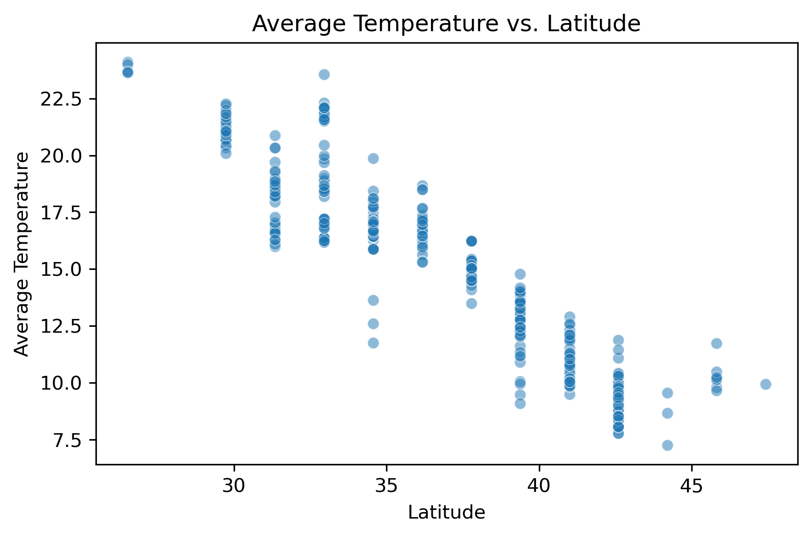

# On Climate Forecasting

We did the data cleaning all together with equal credit.

## Task 1: Cluster Analysis - Nicola Aladrah

### Data Cleaning

The original analysis is based on three raw datasets:

- `pollution_us_2000_2016`: Contains air pollutant measurements (NO₂, SO₂, CO) across various U.S. cities from 2000 to 2016.
- `greenhouse_gas_inventory_data_data`: Contains CO₂ emissions data categorized by source type and region.
- `GlobalLandTemperaturesByCity`: Provides average monthly land temperature records for cities around the world.

To prepare these datasets for analysis, the following cleaning and integration steps were applied:

1. Date Normalization:

    - Dates in all datasets were originally in varying formats (day/month/year).
    - To enable uniform temporal aggregation, all date columns were converted to a standard Year format by extracting only the year component.

2. City-Year Grouping:

    - After converting dates to years, the data was grouped by unique pairs of City and Year.
    - For each city-year pair, numerical features were averaged to produce annual summary statistics.

3. Merged Dataset Construction:

    - The datasets were then merged on the basis of City and Year, aligning temperature, pollutant, and CO₂ data.
    - The result is a unified dataset with the following features:
       
        | Feature | Description |
        | ------- | ----------- |
        | `City`  | Name of the city |
        | `Year`  | Year of observation (integer) |
        | `AverageTemperature` | Mean annual land temperature |
        | `NO2 Mean`	| Mean annual NO₂ concentration |
        | `SO2 Mean`	| Mean annual SO₂ concentration |
        | `CO Mean`	| Mean annual CO concentration |
        | `Latitude` | Geographic latitude of the city |
        | `Longitude` |	Geographic longitude of the city |
        | `Avg_CO2_natural_pross` |	Average CO₂ emissions from natural processes |

**The code of the data cleaning of Task 1 is [here](Cleaning_data_Task1.ipynb)**

### How We Applied Cluster Analysis on The New Data

**The code of the Cluster Analysis is [here](Project3_nicola.ipynb)**

We have studied 248 cities. The dataset includes measurements of several environmental indicators such as Average Temperature, NO₂ Mean, SO₂ Mean, CO Mean, and Avg_CO₂_natural_pross. The **goal** of this analysis is to explore natural groupings within the data using the K-means clustering algorithm. Additionally, geographic coordinates (Latitude and Longitude) are incorporated to provide insights into the spatial distribution of the clusters.

The data are preprocessed in **two modes**:

- `City-Year` Level: Each record represents a unique city and year. 
- `City` Level: Measurements are averaged over all years, resulting in one record per city.

#### Methodology

- Elbow Method: The within-cluster sum-of-squares is computed for a range of potential cluster counts. A plot is generated to help visually identify the “elbow,”. _Still, this is not the most easier way to determine the number of cluster_.
- Silhouette Score: For each number of clusters, the average silhouette score is calculated to assess the compactness and separation of the clusters. Higher silhouette scores indicate better-defined clusters. _It was important to support Elbow method with Silhouette Score for best `k` value_.

#### Clustering Execution

- K-means Clustering: Based on the evaluation metrics, a specific number of clusters is selected. The K-means algorithm is then applied to partition the dataset into clusters.
- Visualization:
  - PCA Visualization: Principal Component Analysis (PCA) is applied to reduce the dimensionality of the data, and a 2D scatter plot is generated where points are colored by their cluster label.
  - Geographic Visualization: When geographic coordinates are included, a separate scatter plot of the actual Latitude and Longitude is produced, revealing the spatial distribution of the clusters.

### Results

We studied the number of the cluster starting from `2` to `248` as the number of the cities, and we found that `k = 30` was the optimal `k`.  
Elbow Plot: The inertia plot did not show a bend around the chosen number of clusters. It is not obvious to determine `k` from the Elbow plot,  

  

Silhouette Scores: The silhouette score plot further supported the selected number of clusters, which is in our case `= 30`, with the highest average score observed at the optimal K.

  

#### Clustering Outcome

Cluster Distribution: When clustering the dataset of 248 cities, with 30 clusters, the K-means algorithm successfully grouped cities with similar environmental profiles. The clusters indicate that certain cities share common characteristics in terms of temperature and pollutant levels. Where we visualized the data using PCA,  

  

And in terms of latitude and longtitude,  

  

**The geographic visualization revealed that cities grouped into the same cluster tend to be geographically proximate or share similar regional environmental conditions**, which up to some accuracy we can see that it matches the [results](https://www.washingtonpost.com/business/2019/10/23/air-pollution-is-getting-worse-data-show-more-people-are-dying/).

## Task 2: Correlation Analysis - Gustavo Paredes Torres

**The code of correlation analysis Task 2 is [here](Correlation_analysis.ipynb).** 

We measure correlations between different variables in the clean dataset called **clean_data.csv**.
The correlation tells us how strongly two variables are related (positive, negative, or no correlation).

### 1 Correlation between Temperature and Latitude

- The idea is to check whether temperature varies with latitude (higher latitudes usually mean lower temperatures).

  For this we use different methods to calculate the correlation using the function corr() like **pearson**, **spearman**, **kendall**.

    - Pearson correlation only captures linear relationships. 

    - Spearman's Rank Correlation (Monotonic Relationships). Useful when the relationship is not strictly linear but still follows a consistent increasing/decreasing trend.

    - Kendall’s Tau (Non-Parametric). Like Spearman, it measures the strength of a monotonic relationship.

    - Mutual Information (Non-Linear Relationships). Measures statistical dependency between two variables. Captures non-linear dependencies, unlike Pearson/Spearman. Uses entropy-based calculations.

    - Distance Correlation (Captures Non-Linear Dependence). Unlike Pearson/Spearman, detects dependencies even if the relationship is not linear

- The next figure shows the relationship between Temperature and Latitude.

    

For the different methods we have the next results:

~~~
Comparison of Correlation Methods:
Pearson: -0.9164
Spearman: -0.9231
Kendall: -0.7979
~~~

- A negative correlation means that temperature decreases as latitude increases (which is expected since higher latitudes are colder).

- A positive correlation would mean that pollution is linked to higher temperatures.

### 2 Correlation between Temperature and Pollution

- We want to check how pollution affects temperature. 

We plot the data to try so see some correlation. 

    

- We analyze the correlation between AverageTemperature and different pollution indicators (NO2 Mean, SO2 Mean, CO Mean).
~~~
Correlation between Temperature and Pollution:
           Pearson  Spearman   Kendall  Distance Correlation   Mutual Information 
NO2 Mean -0.040127 -0.043590 -0.032454              0.118242             0.214950 
SO2 Mean -0.311894 -0.290074 -0.197766              0.341715             0.245289
CO Mean   0.025227  0.007859  0.009870              0.173909             0.200712
~~~
We can see this data in the following figure:

    

Observations:

- Pearson correlation is very weak (close to 0) for NO2 and CO, suggesting little to no linear relationship.

- SO₂ shows the strongest negative correlation (~ -0.31 to -0.29), indicating that as SO₂ increases, temperature tends to decrease.

- Distance Correlation & Mutual Information are higher than Pearson/Spearman, suggesting that some non-linear relationships may exist.

There are several possible reasons for this results:

- (a) Pollution and Temperature are not directly linked at the local level

    While pollution does contribute to climate change, its effect is not instantaneous or direct on daily temperature.

    Pollution (like CO₂ and NO₂) traps heat in the atmosphere, but this happens on a larger scale over many years, not necessarily in a single city over a short time period.

    The greenhouse effect is a global phenomenon, while we are analyzing individual cities.

- (b) Data Issues: Time Lag Effects

    The effects of pollution on temperature might take years to manifest, but your dataset likely contains yearly city-level data.

    If temperature increases lag behind pollution emissions, a simple correlation will not capture this.

- (c) Other Factors Affecting Temperature

    Temperature is influenced by multiple factors, including latitude, altitude, ocean currents, and weather patterns.

    If these other factors are stronger than pollution at the city level, the direct correlation will be weak.

- (d) Pollution Levels Vary with Seasons

    Some cities experience higher pollution levels in winter, but temperature is lower due to natural seasonal variation.

    This can introduce false negative correlations, especially in cases like SO₂, which is emitted from coal burning (used more in winter for heating).

SO₂ is showing the strongest correlation:

- SO₂ comes from fossil fuel combustion (coal, oil, diesel), and it contributes to aerosol formation.

- Aerosols reflect sunlight (cooling effect), which can lower local temperatures.

- This explains why SO₂ has a negative correlation with temperature.

### 3 Correlation between Temperature Change and Pollution

- We need to calculate temperature change over the last three years for each city.

	- Example: For Year = 2013, we compute the difference between the average temperature of the last 3 years (2011-2013) and the previous period (2008-2010).

- Then, we check the correlation between temperature change and pollution levels to see if pollution is affecting long-term temperature trends.

For this part we hace the following results:

~~~
Correlation between Temperature Change and Pollution:
           Pearson  Spearman   Kendall  Distance Correlation
NO2 Mean -0.144141 -0.043483 -0.027459              0.168312
SO2 Mean -0.099162 -0.000733  0.006894              0.157390
CO Mean  -0.122866 -0.123544 -0.081433              0.220859
~~~
The next plot shows the results:

    

This correlation results indicate how pollution levels correlate with temperature change over time (computed as the 3-year moving average difference per city).

Pearson (-0.14 to -0.12)

- Shows a weak negative linear correlation between temperature change and pollution levels.

- Meaning: As pollution increases, temperature change slightly decreases, but the relationship is weak.

Spearman (-0.043 to -0.123)

-Measures monotonic relationships (not strictly linear but increasing/decreasing trends).

-Very low values indicate no strong monotonic trend.

Kendall (-0.027 to -0.081)

- Similar to Spearman but better for smaller datasets or when there are tied values.

- Almost zero, meaning weak to no correlation.

Distance Correlation (0.157 to 0.220)

- Unlike Pearson, this metric detects both linear and non-linear dependencies.

- Higher than Pearson/Spearman, suggesting there might be some non-linear effects.

## Summary

### Correlation part:

- Temperature vs. Latitude → Weak negative correlation (higher latitude, lower temperature).

- Temperature vs. Pollution → Weak correlation, with SO₂ showing the strongest negative effect (possible cooling due to aerosols).

- Temperature Change vs. Pollution → Slight negative correlation (-0.1 to -0.14), suggesting pollution has little short-term impact on temperature trends.

So we can say that the  Pollution’s effect on temperature is complex and long-term, requiring time-lagged analysis for deeper insights