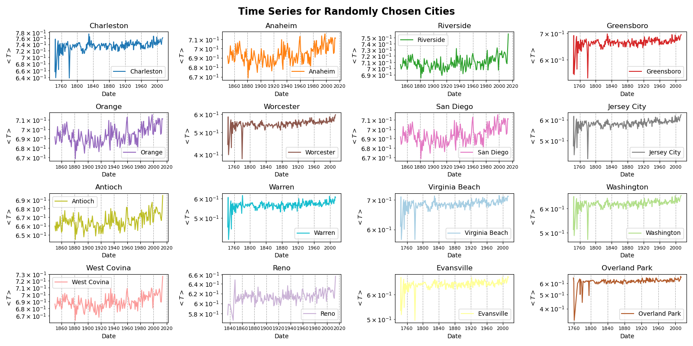
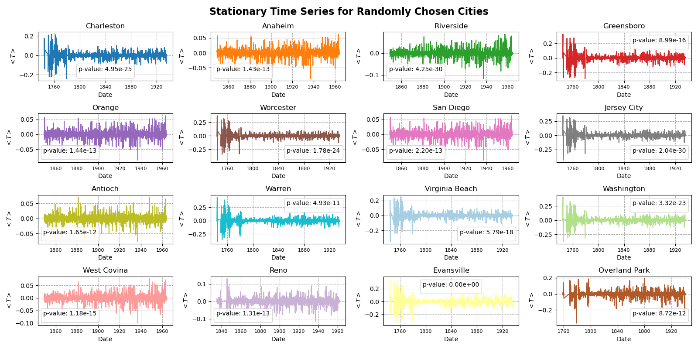

## Task 3: Temperature Forecasting - Bellou

The aim of this section is to build an ARIMA model that forecasts temperature \( T \) levels for US cities over a period of time \( \Delta t \). The data used for this is labeled `GlobalLandTemperaturesByCity.csv`. It consists of seven columns (features): `AverageTemperature`, `AverageTemperatureUncertainty`, `City`, `Country`, `Latitude`, and `Longitude`, with a total of 8,599,212 rows (observations). The data spans from November 1, 1743, to September 1, 2013.

To accomplish the aim of this section, three subtasks must be completed:

1. Cleaning the temperature data
2. Making the time series stationary
3. Implementing the ARIMA model and using it for forecasting

### 1. Cleaning the Data

First, undefined values were dropped, and duplicates were removed. The index of the dataset was set to the `Date` column, which was then converted to the Pandas `datetime` type. Only data corresponding to US cities was retained, while irrelevant features were removed. Finally, `AverageTemperature` values were normalized to the interval \([0,1]\) using MinMaxScaler, and the data was grouped by `City` and resampled based on the specified period.

This workflow was implemented in a function named `clean_data(df, period)`, which takes the dataset as input and returns the corresponding cleaned and resampled time series.

```python

def clean_data(df, period):
    if period not in ["YE", "ME"]:
        return "Option not supported, please use either 'YE' (yearly) or 'ME' (monthly)"
    
    df = df.dropna()  # Removing NaN values
    df = df.drop_duplicates()  # Dropping duplicates
    df.set_index("dt", inplace=True)  # Setting the date as index
    df.index = pd.to_datetime(df.index)  # Converting index to datetime format
    df = df[df["Country"] == "United States"]  # Selecting only US cities
    df = df.drop(["AverageTemperatureUncertainty", "Country", "Longitude", "Latitude"], axis=1)
    
    # Scaling AverageTemperature to [0,1]
    scaler = MinMaxScaler()
    df["AverageTemperature"] = scaler.fit_transform(df[["AverageTemperature"]])
    
    df = df.groupby("City").resample(period).mean()  # Resampling and averaging temperature
    df = df.dropna()
    
    return df
```

The figure below shows the time series for the following 16 cities: Charleston, Anaheim, Riverside, Greensboro, Orange, Worcester, San Diego, Jersey City, Antioch, Warren, Virginia Beach, Washington, West Covina, Reno, Evansville, and Overland Park.


To improve visualization, the data was resampled yearly, and the resulting figure is shown below.



### 2. Making the Time Series Stationary

The time series for all cities were split into training (70%) and testing (30%) sets. The training set was used to train the ARIMA model, while the test set was used for evaluation. The split was performed using `train_test_split` from `scikit-learn`.

- The training set contains **2,183** observations.
- The test set contains **936** observations.

Seasonal decomposition was applied to the training data to remove seasonal and trend components, resulting in a stationary time series. The Augmented Dickey-Fuller (ADF) test was then used to confirm stationarity. The resulting p-values were below the 0.05 threshold, allowing us to reject the null hypothesis of non-stationarity.

```python
from statsmodels.tsa.stattools import adfuller

def check_stationarity(series):
    result = adfuller(series)
    return result[1] > 0.05, result[1]  # If True, series is non-stationary

non_stationary_count = 0
for key, data in train_data_stationary.items():
    X = data["AverageTemperature"]
    is_non_stationary, p_val = check_stationarity(X)
    if is_non_stationary:
        non_stationary_count += 1
        print(f"{key}: p-value = {p_val}")

print(f"There are {non_stationary_count} non-stationary time series.")
```

```console
There are 0 non-stationary time series.
```



### 3. The ARIMA Model

After confirming stationarity, the ARIMA model was implemented. The optimal parameters \( p, q, d \) were selected, and the model was trained using the training dataset. The model's predictions were then evaluated using the Mean Square Error (MSE) metric:

$$
MSE = \frac{1}{N} \sum\limits_{i=1}^{N} \left \lVert y_i - \hat{y}_i \right \rVert ^2
$$

where:
- \( y_i \) represents the actual temperature values from the test set.
- \( \hat{y}_i \) represents the predicted values from the ARIMA model.

The results are summarized in the table below:

| City            | MSE                | AIC                 | BIC                 |
|----------------|--------------------|---------------------|---------------------|
| Charleston     | 0.5623              | -9432.33            | -9375.44            |
| Anaheim       | 0.4920              | -7953.64            | -7901.32            |
| Riverside      | 0.5267              | -7133.87            | -7081.55            |
| Greensboro     | 0.4703              | -8656.83            | -8599.95            |
| Orange        | 0.4920              | -7953.64            | -7901.32            |
| Worcester      | 0.3384              | -8018.82            | -7961.94            |
| San Diego      | 0.4920              | -7953.64            | -7901.32            |
| Jersey City    | 0.3768              | -8069.08            | -8012.19            |
| Antioch        | 0.4559              | -7974.19            | -7921.87            |
| Warren         | 0.3597              | -7727.25            | -7670.29            |
| Virginia Beach | 0.4953              | -9166.92            | -9110.04            |
| Washington     | 0.4211              | -8116.44            | -8059.55            |
| West Covina    | 0.4935              | -7587.14            | -7534.82            |
| Reno          | 0.3959              | -7027.30            | -6974.54            |
| Evansville     | 0.4554              | -8115.53            | -8058.64            |
| Overland Park  | 0.4267              | -7789.47            | -7733.29            |

### Conclusion

- The ARIMA model successfully predicted temperature variations with reasonable accuracy.
- The MSE values indicate that the model's performance is consistent across different cities.
- Future improvements could involve testing additional models, such as LSTM or Prophet, for better forecasting accuracy.

